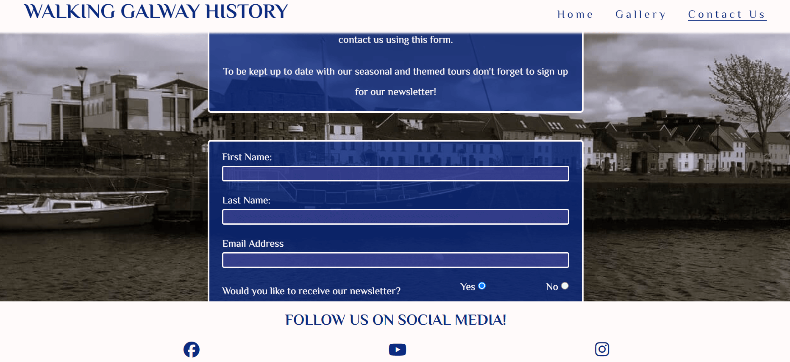
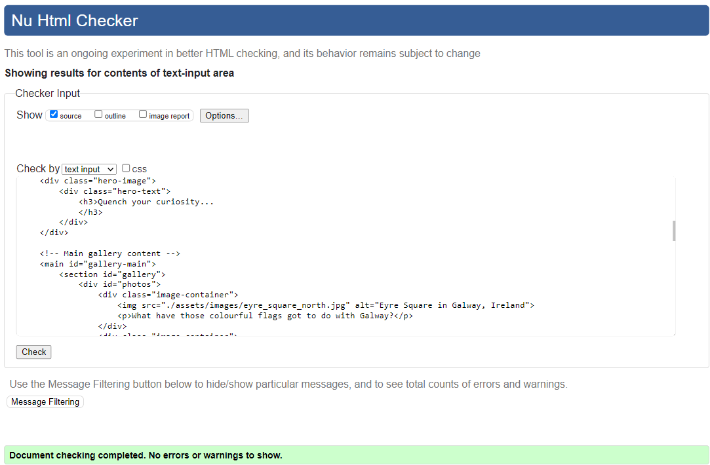

# Walking Galway History

The aim of this website is to provide clear and concise information on walking tours of Galway, Ireland, which focus on the city's history.

It is aimed primarily at tourists and visitors to Galway, and it is designed to provide eaily accessible and up-to-date information about the walking tours on offer. 

Find the link to the site [here](https://niallpcarroll.github.io/walking-galway-history/)

## Contents

- [User Experience](#user-experience)
  - [User Stories](#user-stories)
- [Design](#design)
  - [Colour Scheme](#colour-scheme)
  - [Typography](#typography)
  - [Imagery](#imagery)
  - [Wireframes](#wireframes)
- [Features](#features)
  - [General Features on Each page](#general-features-on-each-page)
  - [Future Implementations](#future-implementations)
  - [Accessibility](#accessibility)
- [Technologies Used](#technologies-used)
  - [Languages Used](#languages-used)
  - [Frameworks, Libraries & Programs Used](#frameworks-libraries--programs-used)
- [Deployment & Local Development](#deployment--local-development)
  - [Deployment](#deployment)
  - [Local Development](#local-development)
    - [How to Fork](#how-to-fork) 
    - [How to Clone](#how-to-clone)
- [Testing](#testing)
- [Credits](#credits)
  - [Code Used](#code-used)
  - [Content](#content)
  - [Media](#media)
  - [Acknowledgments](#acknowledgments)

## User Experience
The Walking Galway History website is designed to be easy and intuitive to use. It does not aim to provide extensive information on the history of Galway, but rather aims to encourage visitors to actually take part in the walks. The main page aims to give the most relevant details which potential visitors would seek, while the gallery page offers images with captions designed to entice visitors to learn more by taking one of the tours.

### User Stories
The website should be very straightforward for first-time users - the aim of the website is clear and the necessary details are easily accessible.

* The user will see a website whose purpuse and function is clear - in this case, providing information about historical walking tours of Galway city.

* The user wants an engaging experience, where the content of the website is clear, consistent and not overloaded with imagery or text.

* The user will experience a "preview" of what they might expect to see if they decide to take one of the tours on offer, i.e. the Gallery page.

* The user wants a clear method for contacting the tour organisers or for signing up to the newsletter - the contact page is accessible through the main menu and through links in the text on the main page and the gallery page.

* Recurring visitors would like a website which is kept up to date and which is not overloaded with information (for example, dates and times of tours which are long past).

* First-time and returning visitors are easily able to access social media links to keep up to date with news and events.

## Design
### Colour Scheme

There are two dominant colours throughout the website: #fffafa and #0c2b80. #fffafa (or "Snow") is an off-white shade, and #0c2b80 is a dark blue. Both colours have been chosen to create high contrast between text and backgrounds in order to create visual impact and accessibility to readers. The colour scheme is inverted a number of times: the header and the footer have dark blue text and icons on the #fffafa background, while the main body has #fffafa text on a dark blue background. A degree of transparency is added to the dark blue in order to bring visibility to the background image of Galway while still maintaining readability.

I used [Contrast Grid](https://eightshapes.com) to check compliance of the main colours with WCAG 2.0 minimum contrast. The result is a rating of 12.1, as seen below:

### Typography
The website uses one font throughout: "Philosopher".

The "Philosopher" font is a sans-serif font which is very neat and suitable for both headings and text. It is clear and easy to read, but is not overly formal in its style.

### Imagery
The images used on the website are up-to-date images of Galway, and they are all images of locations which visitors can expect to visit if they take part in a walking tour.

### Wireframes 
These were the original ideas for the three different sections:

Images of wireframes for mobile devices:

***

Images of wireframes for tablets:

***

Images of wireframes for large screens:

***

## Features
This site contains three pages:
- Home page
- Gallery page
- Contact page
### General Features on each page
**The header**, which displays the name of the website, sticks to the top of the viewport. On smaller screens there is a dropdown menu from a "burger" icon, which the user can employ to navigate to other pages on the website. On larger screens the dropdown menu opens out across the header, providing clear navigation buttons. Here is an image of the header with the opened menu as it appears on a mobile device:

Screenshot of the Header

**The footer** contains links to Facebook, YouTube and Instagram to encourage visitors to keep in contact via social media. It provides easy access to social media links for users as it is stuck to the bottom of the viewport:

Screenshot of the Footer

### The Home page
**The Home page** aims to give the visitor clear information about the walking history tours, including times and other considerations (e.g. accessibility). It employs two background images of Galway city. These images are in black and white - apart from giving an appropriate "antiquated" feel, they do not distract the viewer from the main content, thus avoiding a visual overload.

On larger screens the text divs are ordered so as to be slightly offset from each other - this is to avoid the screen appearing too text-heavy, while also revealing different sections of the background image as the user scrolls through the page. On larger screens, the "Home" button in the menu is underlined. On smaller screens, the text areas appear in a single column - however, the light-coloured border is designed to give emphasis to the individual text areas to avoid the impression that there is one single block of text. The icons and the headings give a clear focus to the content of each text area.

Screenshot of the Home page

### The Gallery page
**The Gallery page** is designed to give the visitor a preview of some of the historical sites they will visit in the course of the walk. With the aim of encouraging viewers to visit the sites in person, there is some text beneath each image which asks a question which will be answered on the tour.

On smaller devices, the images appear in a single column, increasing to two columns and then three for larger screens. On larger screens, the "Gallery" button in the menu is underlined. The background colour for the gallery page is dark blue (#0c2b80) - there is no black and white image of Galway employed as in the home and contact pages in order to avoid the gallery page being too cluttered with layers of imagery.

Screenshot of the Gallery page

### The Contact page
**The Contact page** is designed to engage visitors, giving them the option to make an enquiry or to sign up for newsletters or details of occasional related events.

As with the home page, the contact page utilises a black and white image for the background, while the text of the contact section lies on a transparent dark blue area. On larger screens, the "Contact Us" button is underlined when the user is on this page.

Screenshot of the Contact page

### The Confirmation page
**The Confirmation page** is a page to which the user will be taken after they submit the contact form. It has the same general style as the other pages, and the text will confirm that their message has been submitted successfully. It is designed to automatically return the user to the home page in ten seconds.

Screenshot of Confirmation page

### The Error page
**The Error page** will appear if a page does not load or if the user attempts to access a non-existent page on the website. This page is styled in the same general way as the rest of the website, and the message which appears provides a link through which the user can return to the homepage.

Screenshot of Error 404 page

### Responsive Design
The site is designed to be responsive throughout - the design changes to be more compatible depending on which screen size the visitor uses. On mobile devices, content appears in a single column, whereas on larger devices the content of the home page spreads out to take up more of the available space, and the gallery images arrange into columns to increase their visibility.

### Future Implementations
There is plenty of potential for future development of this website. Some features that are planned but not yet executed are:
- The possibility of a comments / review section. 
- The possibility of an additional page with images and information of seasonal / occasional tours which might interest visitors.
- The possibility of an additional page containing little-known facts about specific elements of Galway's history to further encourage uptake of the tours.

### Accessibility
The site is designed to be accessible. Measures taken to ensure this include:
- Design which aims to minimise clutter, avoiding overload of images and text
- High colour contrast between background and text
- Clearly defined text areas
- Alt attributes on all images
- Aria labels on all icons

## Technologies Used

### Languages Used
This website has been created using HTML and CSS

### Frameworks, Libraries & Programs Used
+ Google Fonts -  For Philosopher font

+ Git - For version control

+ Github - To save & store files and deployment

+ Gitpod - IDE used to write the code

+ Font Awesome - For icons used in header and footer

+ Balsamiq - For wireframes

+ [Icons 8](https://icons8.com) for the Favicon image

## Deployment & Local Development

### Deployment
Github pages is used to deploy this site. To deploy the site yourself, follow these instructions:

- Sign in to Github
- Go to the repository for this project called [*walking-galway-history*](https://github.com/niallpcarroll/walking-galway-history.git)
- Click *settings*
- In the column to the left, click *pages*
- From the dropdown, select *main branch* and then save
- The site is now deployed!
### Local Development

#### How to Fork
To fork the repository:

- Log in to Github

- Go to the repository for this project called *walking-galway-history*

- Click the Fork button in the top right corner
#### How to Clone
- Log in (or sign up) to GitHub.

- Go to the repository for this project, [*walking-galway-history*](https://github.com/niallpcarroll/walking-galway-history.git).

- Click *Code* and choose whether you would like to clone with HTTPS, SSH or GitHub CLI and copy the link.

- Open the terminal in your code editor and change the current working directory to the location you want to use for the cloned directory.

- Type the following command in the terminal (after the git clone you will need to paste the link you copied in step 3 above):

      git clone { & THE LINK FROM STEP 3 }

## Testing
### Validator Testing
I have used W3C validator to validate my HTML code and CSS code. I validated them via direct input.
Both passed without errors.

#### HTML Validation

Index/Landing page HTML validation
 

Gallery page HTML validation

Contact page HTML validation

#### CSS Validation

Walking Galway History CSS validation

#### Lighthouse
Lighthouse is a tool created by Google to test a website's performance, accessibility, best practices, SEO and qualification as a progressive web application.

It gives scores on the usability of the site. The test is done for mobile version and desktop version.

**The score for a mobile device:**

**The score for a desktop device:**

#### WAVE
Wave is another tool to test the accessibility of the site. This is the result:

An error appeared after the first test, indicating that a label element was missing text content. This error was corrected by adding an aria label and description to the label element in the navbar section.

### Manual Testing
#### Features
Below is a table with the sites features, how it has been tested and what the outcome were.

|Feature|Test case|Outcome|
|---|---|---|
|Header |Scroll down through site |Sticks to top of viewport |
|Nav bar - Home |Click |Redirected to home page |
|Nav bar - Gallery |Click |Redirected to Gallery page |
|Nav bar - Contact |Click |Redirected to Contact page |
|Nav bar - Icon (tablets and smaller) |Click |Menu shows |
|Google Maps link |Click |Opens in new tab with location pin |
|Contact links |Click |All redirect to contact page |
|Contact form |Give the required information |Form is successfully sent |
|Contact form |Omit required information |Form does not send; Notification displays |
|Contact form - submit button |Click |Submits form |
|Confirmation page |After clicking submit button |Displays confirmation |
|Confirmation page |10 seconds after displaying |Redirects to home page | 
|Social media link - Facebook |Click |External link to Facebook |
|Social media link - Youtube |Click |External link to Youtube |
|Social media link - Instagram |Click |External link to Instagram |

#### Screen size compability
Below is a table with different devices and the outcomes when visiting the site using different screen sizes.

|Device|Site responsive <768px|Site responsive 768px to 991px|Site responsive 992px to 1919px| Site responsive >=1920px| Renders as expected |
|---|---|---|---|---|---| 
|Galaxy S8+ |Yes |n/a |n/a |n/a |Yes |
|iPad Mini |n/a|Yes |n/a |n/a |Yes |
|Laptop (1366px wide) |n/a |n/a |Yes |n/a |Yes |
|Desktop (1920px wide) |n/a |n/a |n/a |Yes |Yes |

#### Browser compability
Below is a table with different browsers, how the site appears on them and how the sites responsiveness is on them.

|Browser|Intended Appearance|Intended Responsiveness|
|---|---|---|
|Chrome |Yes |Yes |
|Firefox |Yes |Yes |
|Edge |Yes |Yes |
|Brave |Yes |Yes |

## Credits

### Code Used
The code for the nav bar (with dropdown menu) and the footer is adapted from the Love Running project (link to Github repository: https://github.com/niallpcarroll/love-running-project.git).

The code for the hero image below the nav bar is adapted from the tutorial at W3Schools (https://www.w3schools.com/howto/howto_css_hero_image.asp)
    

### Content    
Remaining content is written by myself.

### Media
Icons used throughout this website are freely available from https://fontawesome.com .

All images - background photographs and gallery images - are my own.

### Acknowledgments
I wish to acknowledge the support given by Code Institute staff, particularly to Amy and to Lewis in Tutor Support, and my peers throughout this project. I also acknowledge the invaluable advice and guidance given by my mentor, Mr Dario Carrasquel.

